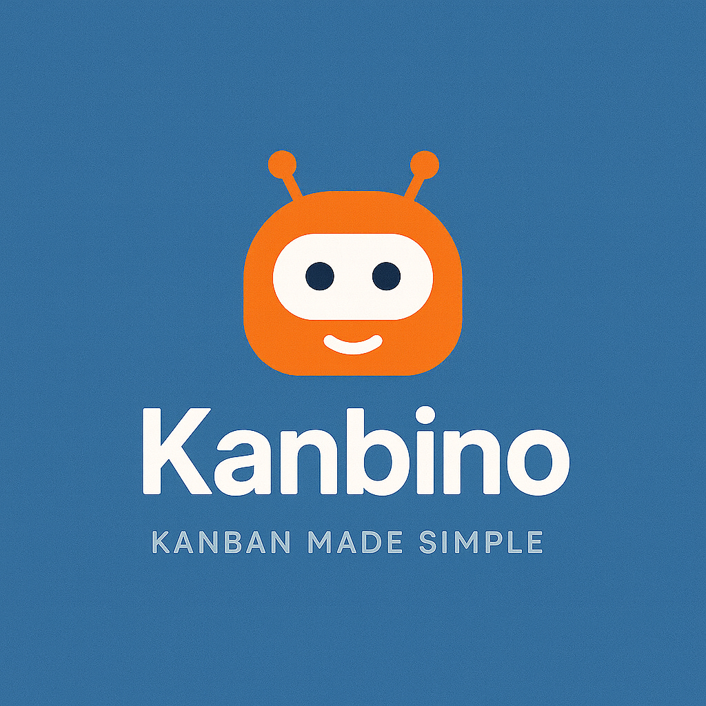

# Kanbino (Frontend)




## Description
Kanbino is a Kanban-style productivity app where users can create boards, add columns, and manage tasks through draggable cards. Cards can be assigned to users, marked as complete, and include comments.

This frontend is built with **React, Vite, Tailwind CSS, and Material UI (MUI)** and communicates with the backend API for authentication, boards, columns, cards, and comments.

---

## Features
- 🔑 User authentication (JWT login/logout)
- 📋 Dashboard showing all boards the user belongs to
- 📂 Create and manage boards, columns, and cards
- 🔄 Drag-and-drop reordering for columns and cards
- 👥 Assign users to cards
- 💬 Comment system on cards
- ✅ Toggle card completion status
- 🎨 Responsive UI using **MUI components** + **Tailwind utility classes**

---

## Getting Started
- **Deployed App**: Coming Soon
- **Backend Repository**: [Kanbino Backend](https://github.com/your-username/kanbino-backend)
- **Planning Materials**: [Wireframes & ERD](https://docs.google.com/document/d/1Cys6bKDTGZIiJmglFjbuwtiGHM4VI3VtuqPL5cyM2gA/edit?usp=sharing)

### Installation & Getting Started

To install dependencies and start the development server, run:
```bash
cd frontend
npm install
npm run dev

To start the development server, run:

```bash
npm install
npm run dev
```

## Building for Production

To create a production build, use:

```bash
npm run build
```

## Project Structure

- `src/` - Main source code directory
- `public/` - Static assets
- `vite.config.js` - Vite configuration

## Attributions

- [React](https://react.dev/)
- [Vite](https://vitejs.dev/)
- [Material UI (MUI)](https://mui.com/)
- [Tailwind CSS](https://tailwindcss.com/)
- [React Router](https://reactrouter.com/)
- [@hello-pangea/dnd](https://github.com/hello-pangea/dnd)

---

## Technologies Used

- **JavaScript (ES6+)**
- **React** (with Vite)
- **Material UI (MUI)**
- **Tailwind CSS**
- **React Router**
- **Axios**
- **@hello-pangea/dnd** (drag-and-drop)

---

## Next Steps

- 🌙 Dark mode toggle via MUI theme + Tailwind classes
- 📱 Mobile-first optimizations and improved touch DnD
- 🔔 Notifications for board activity and mentions
- 🖼 User profiles with avatars and presence
- ⚡ Real-time updates (websockets)
- ♿ Accessibility improvements for keyboard navigation & DnD
- 🏷 Card labels/tags and filters


